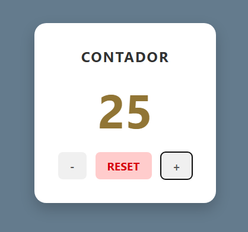

# Contador

Aplicativo web simples e divertido para contar cliques e testar sua velocidade de clique.

## Sobre

Este projeto oferece um contador interativo com dois modos principais:
- Contador normal com incremento, decremento e reset
- Jogo de Cliques Por Segundo (CPS) com cronômetro e resultado de velocidade

O contador também mantém o valor atual e as cores dos grupos de números entre sessões usando `localStorage`.

## Funcionalidades

- **+** aumenta o contador
- **-** diminui o contador (não permite valores negativos)
- **RESET** zera o contador e reinicia as cores
- **START** inicia o modo CPS com contagem regressiva
- **🟢** botão de clique para registrar cliques durante o teste
- Exibição do resultado de cliques por segundo após o fim do teste
- Cores geradas automaticamente por grupo de 50 valores
- Dados salvos no navegador para manter o contador entre recarregamentos

## Tecnologias

- **HTML5** — estrutura do layout
- **CSS3** — estilo e responsividade
- **JavaScript** — lógica do contador, cronômetro e armazenamento local
- **localStorage** — persistência dos dados do contador e das cores

## Como Usar

1. Abra o arquivo `index.html` no navegador
2. Use o contador normal com os botões:
   - **+** para aumentar
   - **-** para diminuir
   - **RESET** para zerar
3. Para jogar o teste de CPS:
   - Clique em **START**
   - Aguarde a contagem regressiva de 3 segundos
   - Clique no botão **🟢** o mais rápido possível durante 5 segundos
   - Veja o resultado em cliques por segundo

## Visualização



## Estrutura do Projeto

```
Contador/
├── index.html              # Página principal
├── assets/
│   ├── css/
│   │   └── style.css       # Estilos da aplicação
│   ├── img/                # Pasta para imagens
│   └── js/
│       └── main.js         # Lógica do contador
└── README.md               # Documentação do projeto
```

## Observações

- O contador não fica negativo.
- O botão CPS só conta cliques durante o teste ativo.
- As cores são atualizadas em grupos de 50 valores para melhorar a visualização.

## Autor

Projeto desenvolvido para prática e aprendizado de JavaScript e interfaces web.
